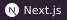
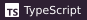

### Hi, I'm Ryan

I'm a software engineering graduate based in London, and right now I'm building **[Crestwell](https://www.crestwell.uk)**.

Crestwell is software that does the paperwork for UK mortgage brokers. A broker gives it a client's documents and a recording of their meeting, and it fills in the mortgage fact find. Every answer shows where it came from, whether that's a payslip or something the client said.

- Drafts the fact find from all of your clients documents
- Records and transcribes meetings and fills straight into your fact find
- Checks files, writes suitability letters, file notes and so much more
- A CRM for the pipeline, commissions, remortgages, team & client communication and daily tasks

The adviser still checks and signs off everything, and Crestwell never gives advice itself.

It's in early access now. If you run a brokerage, or know someone who does, take a peak.

**Built with**

   

---

[Website](https://www.rynnjones.com) · [LinkedIn](https://www.linkedin.com/in/rynnjones) · [Email](mailto:contact@rynnjones.com)
